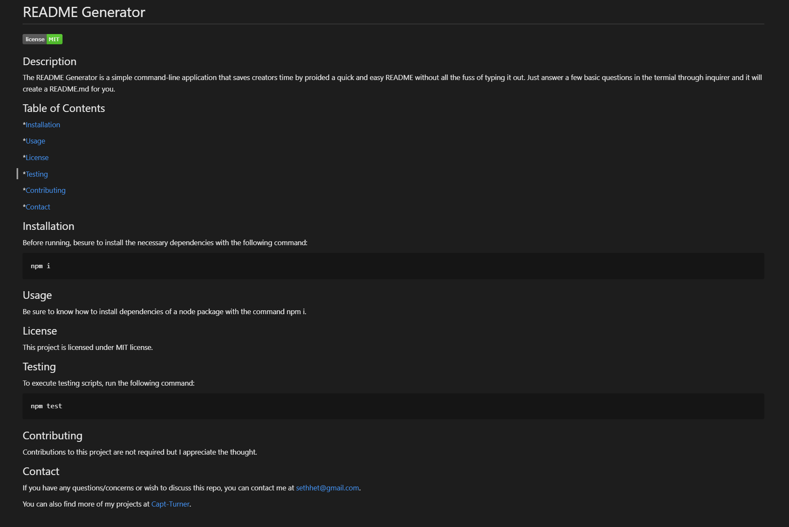

# Welcome to the README Generator

## What is it?

The README Generator is a simple command-line application that saves creators time by providing a quick and easy README without all the fuss of typing it all out. Just answer a few basic questions in the terminal through inquirer and it will create a README.md for you.

## How does it work?

Below is a short GIF to walk you through the process.

Here is an example of a generated README.

